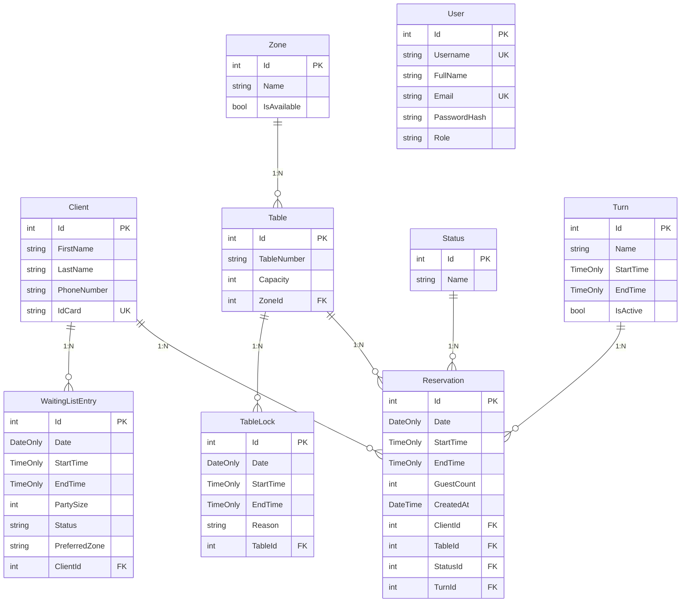

# RestauranteAPI

API REST para la gestión de reservas de un restaurante. Construida con ASP.NET Core 10, Entity Framework Core, autenticación JWT y SQL Server.

---

## Tecnologías

- **Runtime:** .NET 10
- **Framework:** ASP.NET Core
- **ORM:** Entity Framework Core 10
- **Base de datos:** SQL Server
- **Autenticación:** JWT (Bearer token)
- **Librerías destacadas:** BCrypt.Net-Next, System.IdentityModel.Tokens.Jwt

---

## Configuración

### 1. Conexión a base de datos

Editar `appsettings.json` con la cadena de conexión a SQL Server:

```json
{
  "ConnectionStrings": {
    "ConnectionSql": "Server=TU_SERVER;Database=TheRestaurant_DB;Trusted_Connection=True;MultipleActiveResultSets=True;TrustServerCertificate=True"
  }
}
```

### 2. JWT

```json
{
  "JwtSettings": {
    "SecretKey": "Tu_Clave_Super_Secreta_De_Al_Menos_32_Caracteres_Para_JWT",
    "Issuer": "RestauranteAPI",
    "Audience": "RestauranteApp",
    "ExpiryInDays": 7
  }
}
```

### 3. Ejecución

```bash
dotnet run
```

La API corre en `http://localhost:5052` por defecto.

Las migraciones se aplican automáticamente al iniciar.

### 4. Datos semilla

Al iniciar se crean automáticamente:

| Elemento | Datos |
|---|---|
| **Cliente** | Juan Jimenez, Maria Lopez, Carlos Fernandez |
| **Zonas** | Terrace, VIP, Indoor, Outdoor |
| **Turno** | General Turn (08:00 - 23:00) |
| **Mesas** | T1 (Terrace, cap 2), T2 (Terrace, cap 4), T3 (VIP, cap 6), T4 (Indoor, cap 8) |
| **Usuario** | admin / Admin123! (rol Admin) |

---

## Autenticación

La mayoría de los endpoints requieren el header:

```
Authorization: Bearer <token>
```

Para obtener un token:

```
POST /api/auth/login
{
  "username": "admin",
  "password": "Admin123!"
}
```

---

## Endpoints

### Autenticación — `api/auth`

| Método | Ruta | Auth | Descripción |
|---|---|---|---|
| POST | `/api/auth/login` | - | Iniciar sesión, devuelve JWT |
| POST | `/api/auth/register` | - | Registrar nuevo usuario |
| POST | `/api/auth/logout` | ✓ | Cerrar sesión (reconocimiento) |
| GET | `/api/auth/me` | ✓ | Obtener información del usuario actual |

### Clientes — `api/clients`

| Método | Ruta | Auth | Descripción |
|---|---|---|---|
| GET | `/api/clients` | ✓ | Listar todos los clientes |
| GET | `/api/clients/{id}` | ✓ | Obtener cliente por ID |
| POST | `/api/clients` | ✓ | Crear cliente |
| PUT | `/api/clients/{id}` | ✓ | Actualizar cliente |
| DELETE | `/api/clients/{id}` | ✓ | Eliminar cliente |

### Mesas — `api/tables`

| Método | Ruta | Auth | Descripción |
|---|---|---|---|
| GET | `/api/tables/layout` | - | Plano del restaurante (zonas + mesas con estado) |
| GET | `/api/tables` | - | Listar todas las mesas con estado en tiempo real |
| GET | `/api/tables/{id}` | - | Obtener mesa por ID |
| GET | `/api/tables/available` | - | Mesas disponibles (query: `date`, `startTime`, `endTime`) |
| GET | `/api/tables/{id}/availability` | - | Verificar disponibilidad de una mesa (query: `date`, `startTime`, `endTime`) |
| GET | `/api/tables/number/{tableNumber}` | - | Buscar mesa por número |
| POST | `/api/tables` | Admin | Crear mesa |
| PUT | `/api/tables/{id}` | Admin | Actualizar mesa |
| DELETE | `/api/tables/{id}` | Admin | Eliminar mesa |

### Zonas — `api/zones`

| Método | Ruta | Auth | Descripción |
|---|---|---|---|
| GET | `/api/zones` | - | Listar todas las zonas |
| GET | `/api/zones/{id}` | - | Obtener zona por ID |
| POST | `/api/zones` | Admin | Crear zona |
| PUT | `/api/zones/{id}` | Admin | Actualizar zona |
| DELETE | `/api/zones/{id}` | Admin | Eliminar zona |

### Reservas — `api/reservations`

| Método | Ruta | Auth | Descripción |
|---|---|---|---|
| GET | `/api/reservations` | ✓ | Listar todas las reservas |
| GET | `/api/reservations/{id}` | ✓ | Obtener reserva por ID |
| GET | `/api/reservations/client/{clientId}` | ✓ | Reservas de un cliente |
| GET | `/api/reservations/date/{date}` | ✓ | Reservas por fecha |
| POST | `/api/reservations` | ✓ | Crear reserva |
| PUT | `/api/reservations/{id}` | ✓ | Actualizar reserva |
| PUT | `/api/reservations/{id}/status/{statusId}` | ✓ | Cambiar estado de una reserva |
| DELETE | `/api/reservations/{id}` | ✓ | Eliminar reserva |

### Turnos — `api/turns`

| Método | Ruta | Auth | Descripción |
|---|---|---|---|
| GET | `/api/turns` | - | Listar todos los turnos |
| GET | `/api/turns/{id}` | - | Obtener turno por ID |
| POST | `/api/turns` | Admin | Crear turno |
| PUT | `/api/turns/{id}` | Admin | Actualizar turno |
| DELETE | `/api/turns/{id}` | Admin | Eliminar turno |

### Estados — `api/statuses`

| Método | Ruta | Auth | Descripción |
|---|---|---|---|
| GET | `/api/statuses` | ✓ | Listar todos los estados |
| GET | `/api/statuses/{id}` | ✓ | Obtener estado por ID |
| POST | `/api/statuses` | ✓ | Crear estado |
| PUT | `/api/statuses/{id}` | ✓ | Actualizar estado |
| DELETE | `/api/statuses/{id}` | ✓ | Eliminar estado |

### Bloqueos de mesas — `api/tablelocks`

| Método | Ruta | Auth | Descripción |
|---|---|---|---|
| GET | `/api/tablelocks` | ✓ | Listar todos los bloqueos |
| GET | `/api/tablelocks/{id}` | ✓ | Obtener bloqueo por ID |
| POST | `/api/tablelocks` | ✓ | Bloquear mesa |
| PUT | `/api/tablelocks/{id}` | ✓ | Actualizar bloqueo |
| DELETE | `/api/tablelocks/{id}` | ✓ | Liberar (eliminar) bloqueo |

### Lista de espera — `api/waitinglist`

| Método | Ruta | Auth | Descripción |
|---|---|---|---|
| GET | `/api/waitinglist` | ✓ | Listar todas las entradas |
| GET | `/api/waitinglist/{id}` | ✓ | Obtener entrada por ID |
| POST | `/api/waitinglist` | ✓ | Agregar a lista de espera |
| PUT | `/api/waitinglist/{id}` | ✓ | Actualizar entrada |
| PATCH | `/api/waitinglist/{id}/status` | ✓ | Cambiar estado (EnEspera/Asignado/Cancelado) |
| POST | `/api/waitinglist/{id}/promote/{tableId}` | ✓ | Ascender a reserva |
| DELETE | `/api/waitinglist/{id}` | ✓ | Eliminar entrada |

### Dashboard — `api/dashboard`

| Método | Ruta | Auth | Descripción |
|---|---|---|---|
| GET | `/api/dashboard` | ✓ | Métricas en tiempo real del restaurante |

---

## Modelo de datos



---

## Estados de las mesas (endpoint `GET /api/tables`)

| Estado | Significado |
|---|---|
| `Libre` | Mesa disponible |
| `Ocupada` | Mesa en uso |
| `Reservada` | Mesa con reserva futura |
| `Bloqueada` | Mesa bloqueada (mantenimiento, evento) |

## Estados de las reservas

| ID | Nombre (DB) | Nombre (DTO) |
|---|---|---|
| 1 | Active | Confirmada |
| 2 | Pending | Pendiente |
| 3 | Completed | Completada |
| 4 | Cancelled | Cancelada |

## Estados de la lista de espera

| DB | DTO |
|---|---|
| Waiting | EnEspera |
| Assigned | Asignado |
| Cancelled | Cancelado |

## Roles de usuario

| Rol | Acceso |
|---|---|
| `Admin` | Crear, modificar y eliminar mesas, zonas y turnos |
| *(otros)* | Acceso a endpoints autenticados estándar |

---

## Manejo de errores

La API responde con un JSON consistente:

```json
{
  "error": {
    "code": "BadRequest",
    "message": "Descripción del error"
  }
}
```

| Código HTTP | Excepción |
|---|---|
| 400 | `InvalidOperationException` |
| 401 | `UnauthorizedAccessException` |
| 404 | `KeyNotFoundException` |
| 500 | Errores internos del servidor |

---

## CORS

Orígenes permitidos: `http://localhost:5173`, `http://localhost:3000`

Métodos y headers permitidos: todos. Soporta credenciales (cookies).
